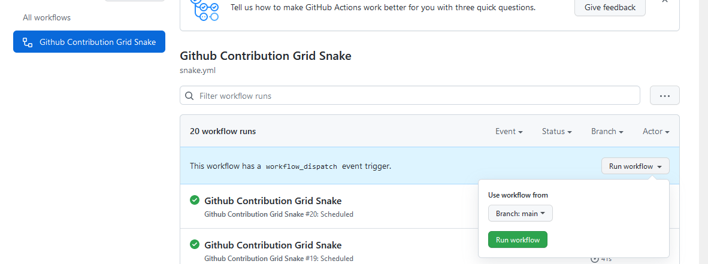

# How to Snake Contribution Graph?

use github action.

---

`/.github/workflows/snake.yml`:

```yaml
name: Github Contribution Grid Snake

on:
  schedule:
    - cron: "* */12 * * *"
  workflow_dispatch:

jobs:
  build:
    name: Snake
    runs-on: ubuntu-latest
    steps:
      - uses: Platane/snk@master
        id: snake-gif
        with:
          github_user_name: Fn79
          svg_out_path: dist/snake.gif

      - uses: crazy-max/ghaction-github-pages@v2.1.3
        with:
          target_branch: snake # Branch: snake
          build_dir: dist
        env:
          GITHUB_TOKEN: ${{ secrets.GITHUB_TOKEN }}
```

and click this.

<a href="https://github.com/Fn79/Fn79/actions"></a>

<a href="https://github.com/Fn79/Fn79/actions"></a>

---

Get Image:

`https://github.com/[name]/[repo]/blob/snake/snake.gif`

<br>

good!